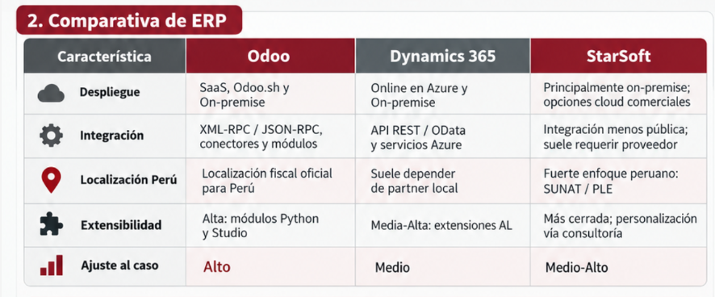

# Ficha de comparación de ERPs y servicios complementarios

## Objetivo

Comparar las alternativas revisadas para cubrir ventas, clientes, inventario e integración tributaria. **UBLHUB no es un ERP generalista**: se incluye porque cubre el componente especializado de documentos electrónicos y complementa al ERP elegido.

*Síntesis visual de las alternativas ERP consideradas. La matriz siguiente añade el papel complementario de UBLHUB y formaliza la decisión.*

| Criterio | Odoo | StarSoft | Microsoft Dynamics 365 Business Central | UBLHUB |
| --- | --- | --- | --- | --- |
| Rol | ERP modular central | ERP de oferta local | ERP empresarial de Microsoft | Microservicio tributario |
| Ventas y clientes | Adecuado para cotizaciones, pedidos, contactos y segmentación | Capacidad comercial por validar en la edición ofertada | Capacidad comercial amplia | Fuera de alcance |
| Inventario | Módulo integrado y extensible | Cobertura por validar con demostración | Módulo integrado | Fuera de alcance |
| Extensibilidad | Módulos, API y ecosistema Python | Interfaces públicas y límites por confirmar | Extensiones AL y servicios de integración | API especializada para documentos electrónicos |
| WhatsApp móvil | Puede registrar el canal manualmente y evolucionar hacia un conector | Integración específica por confirmar | Integración posible mediante servicios, con mayor complejidad para este caso | No administra conversaciones ni pedidos |
| Facturación peruana | Requiere localización/configuración e integración verificadas | Oferta local orientada a normativa peruana; detalle técnico por verificar | Depende de localización y partner | Componente elegido para boletas, facturas y guías de remisión |
| Ajuste al caso | Alto por modularidad y facilidad de iniciar con alcance comercial | Alternativa local considerada | Alternativa robusta, con complejidad y dependencia de partner | Alto como complemento especializado |
| Decisión | **Seleccionado como ERP central** | No seleccionado | No seleccionado | **Seleccionado como microservicio tributario** |

## Resultado

Se selecciona la combinación **Odoo + UBLHUB**:

- Odoo mantiene la ficha única del cliente, el pedido, el canal de origen, el inventario y el estado comercial.
- UBLHUB recibe solicitudes de emisión, procesa boletas, facturas y guías de remisión, y devuelve el estado y los archivos correspondientes.
- WhatsApp móvil sigue siendo un canal atendido manualmente en la primera etapa; cada pedido originado allí se registra en Odoo.
- StarSoft y Dynamics 365 Business Central se conservan únicamente como alternativas comparadas y como referencia para revisar la decisión si cambian las restricciones.

## Validaciones pendientes

La elección funcional no reemplaza la validación técnica y contractual. Antes de producción se deben confirmar versiones, licencias, modalidad de despliegue, API de UBLHUB, autenticación, formatos, estados, reintentos, soporte, SLA, costos y ambiente de pruebas.
