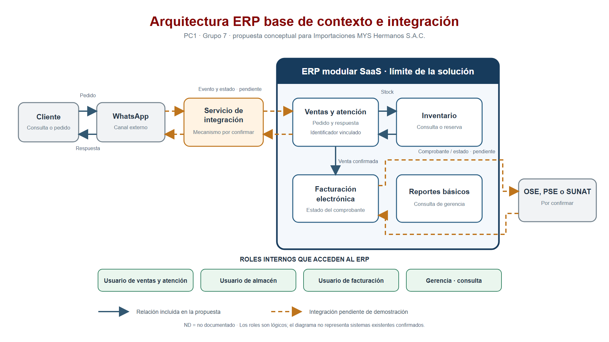

# Arquitectura ERP base para PC1

## 1. Propósito y alcance

**Evidencia:** la ficha S1, §4, plantea una falta de integración entre atención y canales digitales; S3, §2, propone ventas, inventario y facturación electrónica para la primera liberación. La ficha RUC SUNAT acredita que la empresa es emisora electrónica, pero no documenta sus aplicaciones internas. **Propuesta:** representar WhatsApp como único canal digital de esta liberación, unido a ventas y atención, inventario y facturación. La existencia de WhatsApp como canal operativo y sus condiciones técnicas están **pendientes** de confirmación con la empresa.

La hipótesis de doble digitación, demora de respuesta, consulta manual de stock, diferencias de disponibilidad, pedidos duplicados, pérdida de trazabilidad y reproceso de comprobantes sigue **pendiente** de observación. Ninguno de esos efectos se presenta como hecho probado.

## 2. Tipo de arquitectura

**Propuesta:** ERP modular SaaS accesible mediante navegador web, con un servicio de integración desacoplado entre WhatsApp y el ERP. El producto no está seleccionado. Odoo y Microsoft Dynamics 365 Business Central continúan como candidatos del comparativo S2; StarSoft permanece como referencia local. La decisión provisional es: **evaluar una arquitectura ERP modular SaaS con una capa de integración para WhatsApp, manteniendo abierta la selección del producto hasta realizar demostraciones, pruebas equivalentes, validación de facturación electrónica y comparación de costos**.

**Supuesto:** un proveedor SaaS o partner operaría la plataforma; el reparto preciso de actualización, respaldo, monitoreo y soporte depende de un SLA aún **pendiente**.

## 3. Actores

| Actor lógico | Interacción propuesta | Estado |
| --- | --- | --- |
| Cliente | Envía consulta o pedido y recibe estado por WhatsApp | Propuesta; flujo real pendiente |
| Usuario de ventas y atención | Revisa conversación vinculada, pedido, disponibilidad y estado del comprobante | Propuesta |
| Usuario de almacén | Consulta o actualiza el estado de inventario desde el ERP | Propuesta |
| Usuario de facturación o contabilidad | Revisa venta y estado del comprobante electrónico | Propuesta |
| Gerencia | Consulta reportes básicos de ventas y operación | Propuesta; necesidad por confirmar |
| Proveedor SaaS o partner | Administra el servicio según contrato; aparece solo en la vista de despliegue | Pendiente de selección y SLA |
| OSE, PSE o SUNAT | Sistema externo de recepción o validación tributaria | Ruta concreta pendiente de confirmar |

Los nombres representan roles, no trabajadores distintos ni una cantidad de empleados. Una persona podría cumplir varios roles.

## 4. Vista de contexto e integración

**Propuesta:** WhatsApp permanece fuera del límite del ERP. Un servicio intermedio conecta el canal con ventas y atención; inventario y facturación son componentes internos. Las líneas discontinuas muestran la conexión WhatsApp–ERP y la integración tributaria **pendientes de demostración**. El diagrama no afirma que la empresa tenga acceso a WhatsApp Business Platform o a una API.

## 5. Lectura del flujo principal

1. **Propuesta:** el cliente inicia una conversación o pedido por WhatsApp.
2. **Pendiente:** se confirma si el acceso será API, webhook, conector o algún otro mecanismo permitido.
3. **Propuesta:** el servicio de integración conserva un identificador externo para relacionar conversación y pedido, y entrega el evento a ventas y atención.
4. **Propuesta:** el usuario de ventas consulta o reserva inventario y confirma la venta en el ERP.
5. **Propuesta:** facturación genera una factura o boleta de prueba conforme al caso aprobado.
6. **Pendiente:** el producto o partner demuestra la ruta hacia OSE, PSE o SUNAT y devuelve aceptación, observación o rechazo.
7. **Propuesta:** el estado regresa a ventas y atención, pasa por el servicio de integración y se comunica al cliente por WhatsApp.

Este recorrido es una hipótesis de arquitectura para contrastar en una demostración; no describe una operación existente.

## 6. Componentes de la solución

| Límite | Componente | Función | Estado |
| --- | --- | --- | --- |
| Externo | WhatsApp | Canal único de conversación y pedido | Propuesta; uso y acceso pendientes |
| Externo | Servicio de integración WhatsApp–ERP | Traduce eventos y relaciona identificadores externos e internos | Propuesta; mecanismo ND |
| ERP SaaS | Ventas y atención comercial | Registra pedido, confirmación y estado comunicado | Propuesta |
| ERP SaaS | Inventario | Informa disponibilidad y reserva o descuenta stock | Propuesta; regla exacta pendiente |
| ERP SaaS | Facturación electrónica | Prepara comprobante y registra su estado | Propuesta; cobertura peruana pendiente |
| ERP SaaS | Reportes básicos | Consulta para gerencia, sin módulo adicional de analítica | Propuesta opcional |
| ERP SaaS | Persistencia transaccional | Conserva pedido, movimiento y estado de comprobante | Propuesta; tecnología del proveedor ND |
| Externo | OSE, PSE o SUNAT | Respuesta tributaria por la ruta que corresponda | Pendiente de confirmación |

## 7. Interfaces

| Origen → destino | Intercambio propuesto | Mecanismo y estado |
| --- | --- | --- |
| Cliente ↔ WhatsApp | Mensaje, pedido y respuesta | Canal propuesto; uso empresarial pendiente |
| WhatsApp ↔ servicio de integración | Evento y respuesta asociados a un identificador externo | **Pendiente:** API, webhook, conector o mecanismo por confirmar |
| Servicio de integración ↔ ventas y atención | Pedido, referencia de conversación y estado | **Pendiente:** API/conector del ERP elegido y prueba de no duplicación |
| Ventas y atención ↔ inventario | Consulta de disponibilidad, reserva o descuento | Propuesta de intercambio interno; comportamiento por demostrar |
| Ventas y atención → facturación | Venta confirmada y referencia del pedido | Propuesta de intercambio interno |
| Facturación ↔ OSE, PSE o SUNAT | Comprobante de prueba y aceptación, observación o rechazo | **Pendiente:** localización, proveedor y ruta tributaria |
| Ventas y atención → servicio de integración → WhatsApp | Estado del pedido o comprobante para el cliente | **Pendiente:** prueba de retorno en el canal |

## 8. Vista de despliegue

**Propuesta:** los roles de la empresa acceden por navegador e internet HTTPS a la aplicación web del ERP SaaS. El servicio de integración se aloja en la plataforma administrada propuesta y se comunica con WhatsApp y el ERP. El ERP mantiene persistencia transaccional y se conecta al servicio tributario que corresponda. **Pendiente:** proveedor, SLA, conectividad, respaldo, actualización, monitoreo y ruta tributaria. No se presupone infraestructura local.

## 9. Decisiones de diseño

| ID | Decisión provisional | Justificación y base | Condición que la cambiaría |
| --- | --- | --- | --- |
| D-01 | Evaluar ERP modular SaaS | **Interpretación** de S2, §5, y S3, §§1-2: reduce operación local si la conectividad y soporte lo permiten | Conectividad, presupuesto o requisito de alojamiento que lo hagan inviable |
| D-02 | Limitar la liberación a WhatsApp, ventas, inventario y facturación | **Propuesta** que acota la hipótesis S1 y el alcance S3 | Validación de la empresa que cambie el canal o alcance |
| D-03 | Separar servicio de integración de WhatsApp y ERP | **Propuesta** para adaptar el mecanismo real sin confundir canal y módulo de ventas | Demostración de integración nativa suficiente y sostenible |
| D-04 | Relacionar conversación, pedido, movimiento y comprobante | **Propuesta** para seguir el flujo y observar duplicados o pérdidas | Restricciones técnicas que exijan otra forma de correlación |
| D-05 | Configurar antes de personalizar | **Interpretación** del riesgo de extensibilidad de S2 y S3 | Una brecha demostrada que no pueda cubrirse por configuración |
| D-06 | Mantener Odoo y Business Central en evaluación | **Evidencia** de que ambos forman parte de S2; selección no aprobada | Demostraciones, cobertura fiscal, soporte y costos comparables |

## 10. Límites

La arquitectura es conceptual. Los sistemas actuales, el acceso técnico a WhatsApp, la integración tributaria, el número de usuarios, la conectividad, el presupuesto, el SLA y el ERP definitivo están **pendientes**. No hay evidencia de implementación ni aprobación productiva.

**Fuera del alcance, en una única lista:** compras, proveedores, importaciones, transporte internacional, nacionalización, aduanas, agentes de aduana, costos de importación, despacho o distribución, posventa, garantías, planillas, manufactura, otros canales digitales, aplicación móvil propia, inteligencia artificial, integraciones bancarias, implementación productiva y migración completa. Esos elementos no aparecen como nodos ni como trabajo comprometido por esta arquitectura.

## 11. Supuestos y pendientes

| Tema | Estado actual | Evidencia necesaria |
| --- | --- | --- |
| WhatsApp utilizado por la empresa | Supuesto; S1 solo describe canales digitales en general | Confirmación del canal y acceso autorizado |
| WhatsApp Business Platform o API | ND | Respuesta del titular del canal y proveedor técnico |
| Sistemas actuales e interfaces | ND en S1/S2 | Inventario de aplicaciones e interfaces de la empresa |
| Cantidad de usuarios y conectividad | ND | Entrevista y medición en sedes aplicables |
| Factura, boleta y ruta tributaria | Emisión electrónica acreditada por RUC; implementación ERP pendiente | Demostración del producto/partner y validación de facturación |
| Presupuesto, soporte y SLA | ND | Cotizaciones y condiciones del proveedor |
| Selección de ERP | Pendiente | Caso común, costos y decisión documentada |

## 12. Archivos gráficos generados

- [Contexto e integración PNG](diagramas/arquitectura-contexto-integracion.png) y [fuente editable SVG](diagramas/arquitectura-contexto-integracion.svg).
- [Despliegue PNG](diagramas/arquitectura-despliegue.png) y [fuente editable SVG](diagramas/arquitectura-despliegue.svg).

Ambos gráficos se preparan a 1920 × 1080 píxeles, relación 16:9. Las referencias son S1, §§3-4; S2, §§1-5; S3, §§1-3; rúbrica PC1, p. 1, y ficha RUC SUNAT, pp. 1-2, registradas en [fuentes](../fuentes/registro-fuentes.md).
