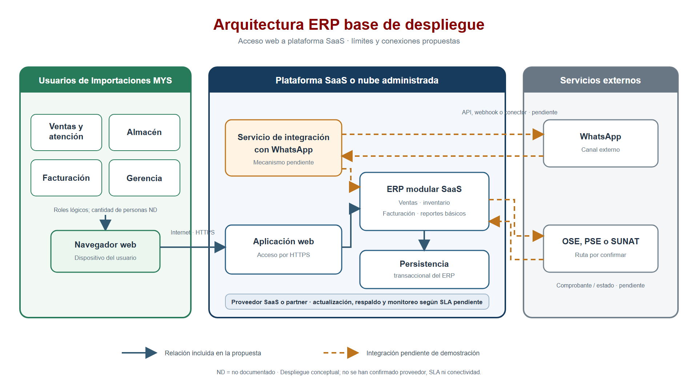
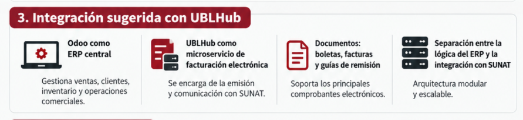
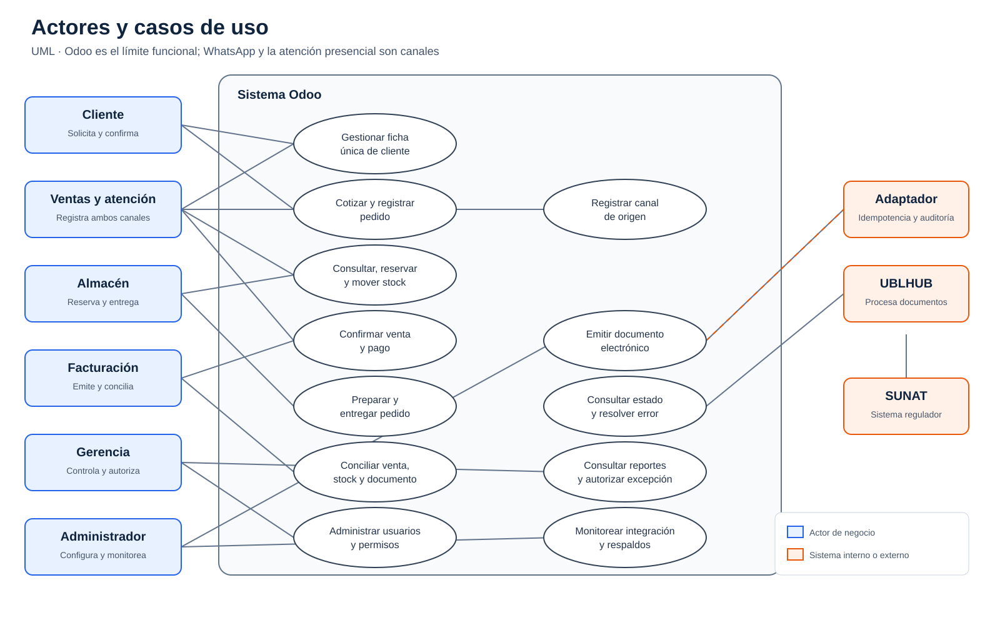
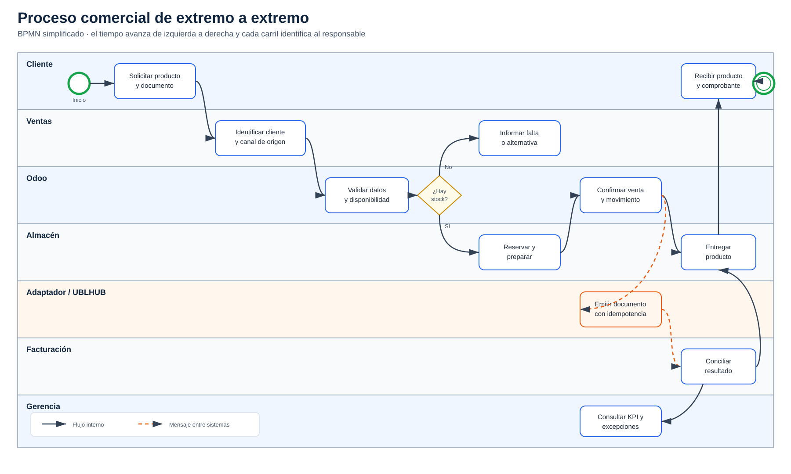
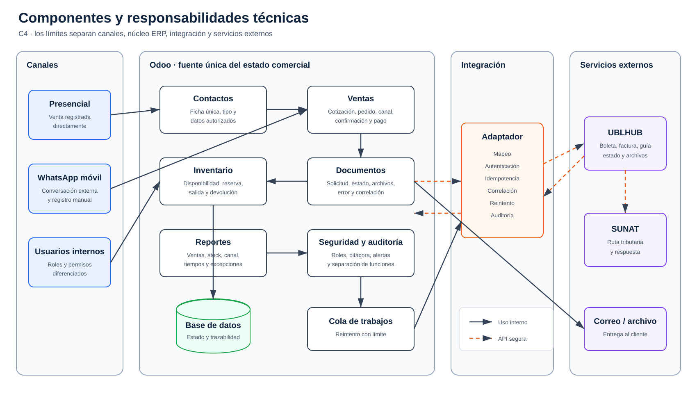
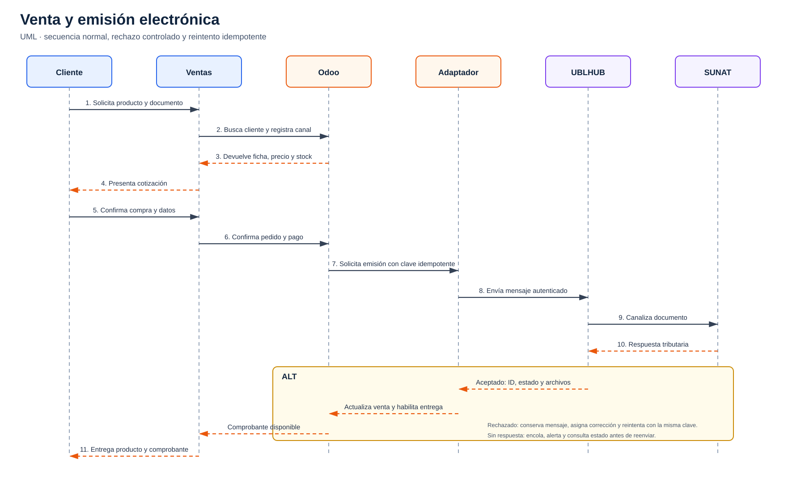
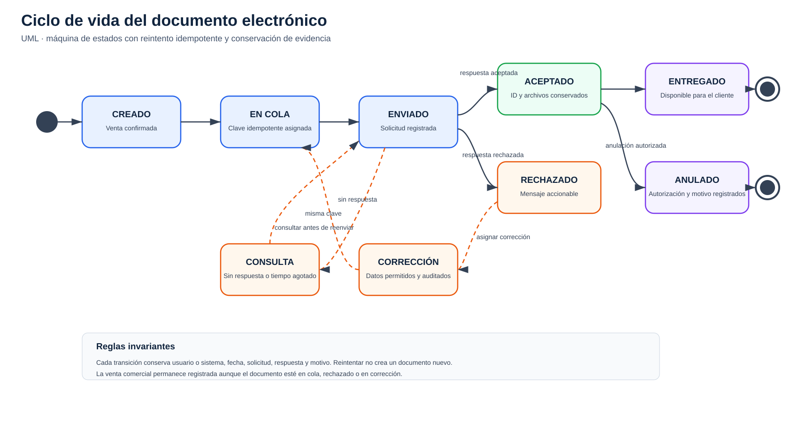

# Ficha de implementación base del ERP

## 1. Propósito

Implementar una fuente única de información comercial para clientes, pedidos, inventario y ventas, con **Odoo como ERP central** y **UBLHUB como microservicio de documentos electrónicos**. La solución atiende dos canales: venta presencial registrada en el ERP y venta por WhatsApp móvil atendida manualmente.

## 2. Arquitectura seleccionada

La solución adopta una arquitectura modular e integrada:

*Vista consolidada de los actores, componentes, límites y conexiones de la solución seleccionada.*

- **Odoo:** clientes, tipos de cliente, productos, cotizaciones, pedidos, inventario, ventas y reportes.
- **Adaptador Odoo–UBLHUB:** transforma solicitudes, conserva correlación, aplica idempotencia y gestiona reintentos.
- **UBLHUB:** emisión y consulta de boletas, facturas y guías de remisión.
- **WhatsApp móvil:** canal externo de conversación. El vendedor registra manualmente cada pedido en Odoo; la automatización está fuera del alcance inicial.
- **Servicio tributario:** destino administrado por la ruta configurada en UBLHUB.

*Separación seleccionada entre la lógica comercial administrada en Odoo y la emisión electrónica delegada a UBLHUB.*

## 3. Actores

Los canales no se confunden con los participantes: `ERP/presencial` y `WhatsApp móvil` indican el origen de la venta. Los actores de negocio, los actores de sistema y sus límites están desarrollados en [Actores, responsabilidades y permisos](actores-y-responsabilidades.md).

| Actor | Tipo | Responsabilidad inequívoca | Límite principal |
| --- | --- | --- | --- |
| Cliente | Negocio externo | Solicita, confirma, paga y recibe producto y documento | No accede al ERP |
| Ventas y atención | Negocio interno | Gestiona cliente, canal, cotización, pedido y comunicación | No ajusta stock ni administra permisos |
| Almacén | Negocio interno | Reserva, prepara, entrega, devuelve y registra movimientos | No modifica precios ni documentos tributarios |
| Facturación y contabilidad | Negocio interno | Supervisa emisión, rechazo, anulación y conciliación | No altera inventario físico |
| Gerencia | Negocio interno | Consulta indicadores y autoriza excepciones | No sustituye la ejecución operativa |
| Administrador ERP e integración | Negocio técnico | Gestiona acceso, configuración, secretos, respaldo y monitoreo | No aprueba sus propios permisos |
| Odoo | Sistema interno | Aplica reglas y conserva el estado comercial oficial | No procesa por sí solo la ruta tributaria delegada |
| Adaptador Odoo–UBLHUB | Sistema interno | Mapea, autentica, correlaciona, evita duplicados y reintenta | No administra clientes, precios o inventario |
| UBLHUB | Sistema externo | Procesa boleta, factura y guía y devuelve resultado | No administra pedidos ni pagos |
| SUNAT | Sistema externo regulador | Recibe y responde por la ruta gestionada por UBLHUB | Su disponibilidad está fuera del control de la empresa |

## 4. Flujo principal

1. El cliente compra presencialmente o solicita por WhatsApp móvil.
2. Ventas busca una ficha existente y evita duplicados; crea el cliente únicamente cuando no existe coincidencia y asigna su clasificación.
3. Registra el pedido en Odoo e identifica el canal de origen.
4. Odoo valida disponibilidad; al confirmar el pedido reserva el stock y al entregar registra la salida.
5. La venta confirmada genera una solicitud de documento al adaptador.
6. El adaptador envía a UBLHUB la boleta, factura o guía con una clave idempotente.
7. UBLHUB devuelve identificador, estado, respuesta y archivos disponibles.
8. Odoo actualiza el estado sin perder la relación con pedido, inventario y cliente.
9. El vendedor entrega el comprobante o informa la incidencia por el canal de origen.

## 5. Componentes

| Límite | Componente | Función |
| --- | --- | --- |
| Canal | Atención presencial / ERP | Captura directa de la venta |
| Canal | WhatsApp móvil | Conversación y pedido atendidos manualmente |
| ERP | Contactos y segmentación | Ficha única y tipo de cliente |
| ERP | Ventas | Cotización, pedido, confirmación, pago y estado |
| ERP | Inventario | Disponibilidad, reserva, salida, devolución y ubicación |
| ERP | Reportes | Indicadores comerciales y operativos |
| Integración | Adaptador Odoo–UBLHUB | Mapeo, seguridad, idempotencia, reintento y auditoría |
| Servicio | UBLHUB | Boletas, facturas, guías y estados asociados |
| Externo | Ruta tributaria | Recepción o validación según configuración aplicable |

El diagrama C4 muestra la responsabilidad estática de cada pieza. El [catálogo de diagramas](diagramas/README.md) explica cuándo usar cada vista.

## 6. Interfaces y datos mínimos

| Interfaz | Datos principales | Controles |
| --- | --- | --- |
| Usuario → Odoo | cliente, tipo, canal, productos, cantidades y entrega | permisos, campos obligatorios y duplicados |
| Odoo → UBLHUB | identificador de venta, emisor, receptor, detalle, totales y tipo de documento | autenticación, validación, cifrado e idempotencia |
| UBLHUB → Odoo | identificador externo, estado, mensaje, archivos y marcas de tiempo | firma/verificación de respuesta, auditoría y reintento controlado |
| Odoo → usuario | disponibilidad, venta y estado del documento | mensajes accionables y restricciones por rol |
| Vendedor → WhatsApp | confirmación, entrega o incidencia | verificación del destinatario y protección de datos |

## 7. Manejo de errores

- Si UBLHUB no responde, la venta permanece registrada y el documento entra en cola de reintento; no se duplica la emisión.
- Si el documento es rechazado, se conserva la respuesta y se habilita una corrección controlada.
- Si se repite la solicitud, la clave idempotente debe devolver o consultar el mismo resultado.
- Si no hay internet, se registra la contingencia y se procesa la cola cuando se restablece el servicio.
- Ninguna falla tributaria debe revertir silenciosamente el movimiento comercial; la conciliación queda visible.

## 8. Seguridad y operación

Los secretos de UBLHUB se almacenan en configuración segura, nunca en el repositorio. Se aplican permisos por rol, bitácora de acciones, copias de seguridad, monitoreo de integración y alertas para documentos en cola o rechazados. Los ambientes de desarrollo y prueba usan datos ficticios.

## 9. Fases

1. **Línea base:** registrar clientes, productos, stock, documentos, usuarios, volúmenes y reglas de operación.
2. **Configuración:** preparar Odoo, roles, catálogos, tipos de cliente y los dos canales.
3. **Integración:** implementar y probar el adaptador con el sandbox de UBLHUB.
4. **Migración y conciliación:** depurar maestros e inventario inicial.
5. **Prueba piloto:** ejecutar ventas presenciales y de WhatsApp con usuarios seleccionados.
6. **Salida controlada:** habilitar producción, monitorear y aplicar plan de retorno.
7. **Mejora:** medir resultados y priorizar la automatización de WhatsApp fuera del alcance inicial.

## 10. Decisiones

| ID | Decisión | Estado |
| --- | --- | --- |
| D-01 | Usar Odoo como ERP central | Adoptada; edición y alojamiento se fijan en la orden de implementación |
| D-02 | Usar UBLHUB para boletas, facturas y guías | Adoptada; la integración usa API autenticada y sandbox antes de producción |
| D-03 | Mantener dos canales: ERP/presencial y WhatsApp móvil | Adoptada |
| D-04 | Registrar manualmente WhatsApp en el alcance inicial | Adoptada; automatización fuera del alcance inicial |
| D-05 | Configurar antes de personalizar | Adoptada |
| D-06 | Usar integración idempotente y auditable | Obligatoria para producción |

## 11. Línea base funcional y operativa

La arquitectura adopta las siguientes reglas para que la implementación no dependa de definiciones abiertas:

- una ficha única por persona o empresa, con control por documento, RUC y teléfono normalizado;
- una organización comercial con ubicaciones de inventario configurables, sin lógica codificada para una cantidad fija de sedes;
- usuarios individuales asignados a los roles definidos; no se permiten credenciales compartidas;
- listas de precios minorista y mayorista, con descuentos excepcionales autorizados por gerencia;
- registro de pago y confirmación del pedido antes de la entrega;
- stock negativo bloqueado; la preventa requiere autorización de gerencia y fecha comprometida;
- series separadas por tipo de documento y establecimiento configurado;
- devolución vinculada a la venta original, con motivo, responsable y movimiento inverso;
- migración de clientes, productos y saldo inicial mediante carga controlada y conciliación;
- soporte funcional a cargo del administrador ERP, soporte operativo distribuido por área y escalamiento tributario a UBLHUB;
- monitoreo de disponibilidad, cola de emisión, rechazos y tiempo de respuesta; los acuerdos comerciales de servicio se registran en la orden de implementación.
