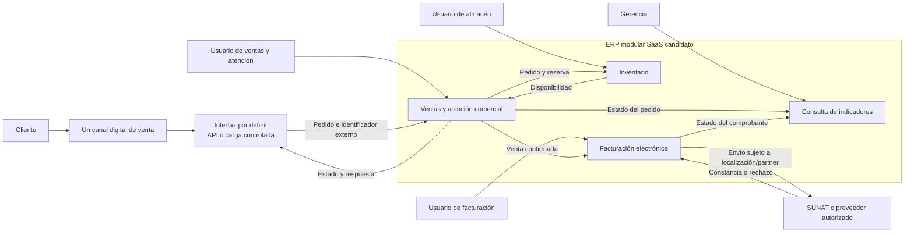

# Arquitectura ERP base propuesta

## Vista de contexto e integración

El siguiente diagrama es una **hipótesis de solución**, no un mapa confirmado de los sistemas actuales. La línea entre canal y adaptador indica una integración por evaluar. La interacción tributaria necesita demostrar soporte real del producto/partner y validar el alcance con facturación.

**Límite de la primera liberación:** ventas, inventario, facturación electrónica y un canal digital. Compras/importaciones, planillas y canales adicionales son posteriores o requieren aprobación. El adaptador puede ser API, conector o importación de archivo con controles; el mecanismo se elige tras inventariar los sistemas reales.

## Interfaces y controles mínimos

| Interfaz | Datos/evento | Control propuesto | Estado |
| --- | --- | --- | --- |
| Canal → ERP ventas | Identificador externo, artículo, cantidad, estado y referencia de cliente sintética en pruebas | Idempotencia y registro de errores para evitar doble pedido | Propuesta; canal y API desconocidos |
| Ventas ↔ inventario | Consulta de disponibilidad, reserva y descuento | Conciliación de stock; impedir stock negativo según regla a validar | Propuesta |
| Ventas → facturación | Venta confirmada, tipo de comprobante e importes | Verificar consistencia con pedido y gestionar rechazo | Propuesta |
| Facturación ↔ SUNAT/proveedor | Emisión, respuesta y estado del comprobante | Guardar identificador, acuse/rechazo y reintentos controlados | Pendiente de prueba y requisitos tributarios |
| ERP → canal/atención | Estado del pedido y respuesta | Evitar datos personales en logs y medir tiempo de respuesta | Propuesta |

## Decisiones de diseño y límites

1. **SaaS modular como opción inicial (D-01):** se deriva de S2, §5, y S3, §2. Validar internet, TI, residencia/control de datos y presupuesto antes de fijar despliegue.
2. **Núcleo de venta, stock y comprobante (D-02):** refleja el alcance propuesto por S3, §2. Las compras/importaciones se modelarán después de la primera liberación.
3. **Integración desacoplada:** permite evaluar API, conector o carga controlada según sistemas reales. No se declara que exista una API en la empresa.
4. **Trazabilidad:** conservar identificadores de pedido, movimiento de stock y comprobante para verificar el flujo y diagnosticar fallos.
5. **Seguridad y privacidad:** perfiles por rol, accesos individuales, copias de seguridad y mínima exposición de datos. La disponibilidad concreta de estas funciones depende del producto elegido.

## Preguntas que pueden cambiar el diagrama

¿Cuál es el canal digital real? ¿Qué sistema registra hoy ventas y stock? ¿Hay tienda y almacén separados? ¿Cuántos usuarios y sedes? ¿Existe internet de respaldo? ¿Quién administra usuarios y soporte? ¿Qué comprobantes y libros integran el alcance? Véase el [backlog](../producto/backlog.md) y los [casos de validación](../pruebas/casos-pc1.md).
