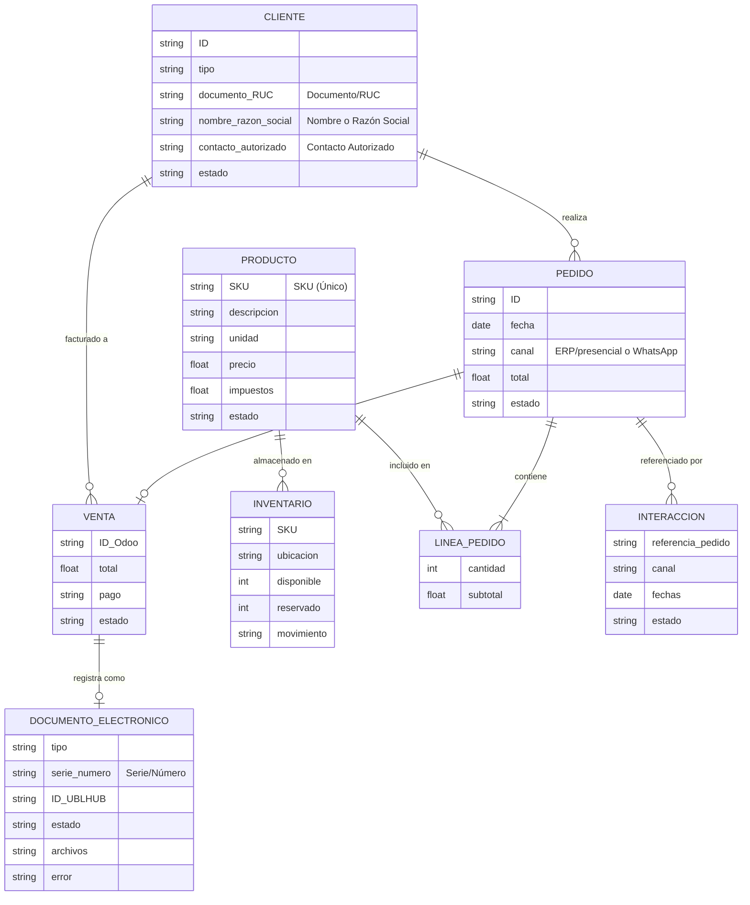

# Modelo de Datos

Este documento define las entidades principales, sus atributos mínimos y las relaciones que conforman el modelo de datos del proyecto (integración Odoo + UBLHUB).

## Diagrama Entidad-Relación (ERD)

A continuación se presenta el diagrama de bloques/ER del modelo de datos:

## Diccionario de Entidades

| Entidad | Descripción | Cardinalidad y Relaciones |
| --- | --- | --- |
| **Cliente** | Representa a una persona o empresa. Se controla por documento o RUC para evitar duplicados. | Un `Cliente` puede realizar múltiples `Pedidos` y tener múltiples `Ventas`. (1:N) |
| **Producto** | Catálogo de bienes o servicios con su información base y precio. Identificado de forma única por su SKU. | Un `Producto` puede tener múltiples registros de `Inventario` y aparecer en múltiples `Líneas de Pedido`. (1:N) |
| **Pedido** | Solicitud de compra proveniente de canales autorizados (presencial o WhatsApp). | Un `Pedido` pertenece a un único `Cliente` (N:1), contiene una o más `Líneas de Pedido` (1:N) y puede generar una `Venta` (1:1). |
| **Línea de Pedido** | Entidad intermedia que desglosa los productos y cantidades solicitadas en un pedido. | Pertenece a un único `Pedido` y referencia a un único `Producto`. |
| **Inventario** | Registro de las existencias, ubicación y movimientos de un producto. | Asociado directamente a un `Producto` (N:1). |
| **Venta** | Registro transaccional en Odoo una vez que un pedido es procesado y pagado. | Generada a partir de un `Pedido` (1:1), asociada a un `Cliente` (N:1) y genera un único `Documento Electrónico` (1:1). |
| **Documento Electrónico** | Comprobante tributario (boleta/factura) procesado a través de UBLHUB. | Corresponde a una única `Venta` (1:1). |
| **Interacción** | Registro de la comunicación en canales (ej. WhatsApp). | Se asocia referencialmente a un `Pedido` (N:1). |

