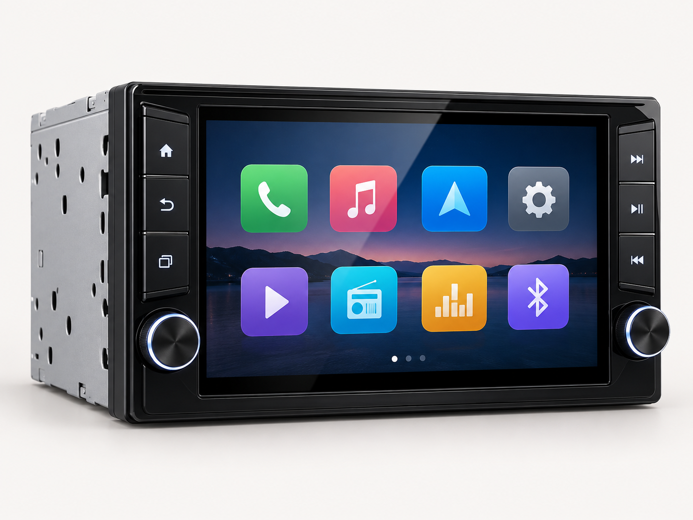

# Prototipo visual de MYS ERP

Frontend estático y navegable para **IMPORTACIONES MYS HERMANOS S.A.C.**. Representa el proceso objetivo con Odoo, dos canales de venta y UBLHUB como microservicio de documentos electrónicos. No contiene backend, base de datos, autenticación ni conexiones reales con Odoo, UBLHUB o servicios tributarios.

## Alcance visual

| Pantalla | Qué representa |
| --- | --- |
| Resumen | Indicadores y pedidos ficticios |
| Pedidos | Registro de ventas ERP/presencial y WhatsApp móvil |
| Inventario | Productos y descuento local de existencias |
| Facturación | Estado visual de boletas, facturas y guías procesadas por UBLHUB |
| Canales | Recorrido canal → Odoo → inventario → UBLHUB |

Los datos se guardan únicamente en localStorage del navegador. No deben ingresarse datos personales reales.

## Ejecutar con Docker

Desde la raíz del repositorio:

~~~powershell
cd producto/frontend
docker compose up --build -d
~~~

Abrir **http://localhost:8080**. Para detener:

~~~powershell
docker compose down
~~~

La imagen utiliza Nginx y archivos estáticos; no levanta Odoo, PostgreSQL ni UBLHUB.

## Ejecutar sin Docker

Abrir [index.html](index.html) en un navegador moderno. El código está en [app.js](app.js) y [styles.css](styles.css).

## Imagen de demostración

La imagen es un recurso ficticio generado para el prototipo y no representa un artículo real de la empresa.

## Próximos pasos

El prototipo debe evolucionar después de validar catálogos, roles, reglas de clientes, stock, documentos y contrato de UBLHUB. La integración real requiere backend, gestión segura de secretos, auditoría y pruebas en sandbox.
