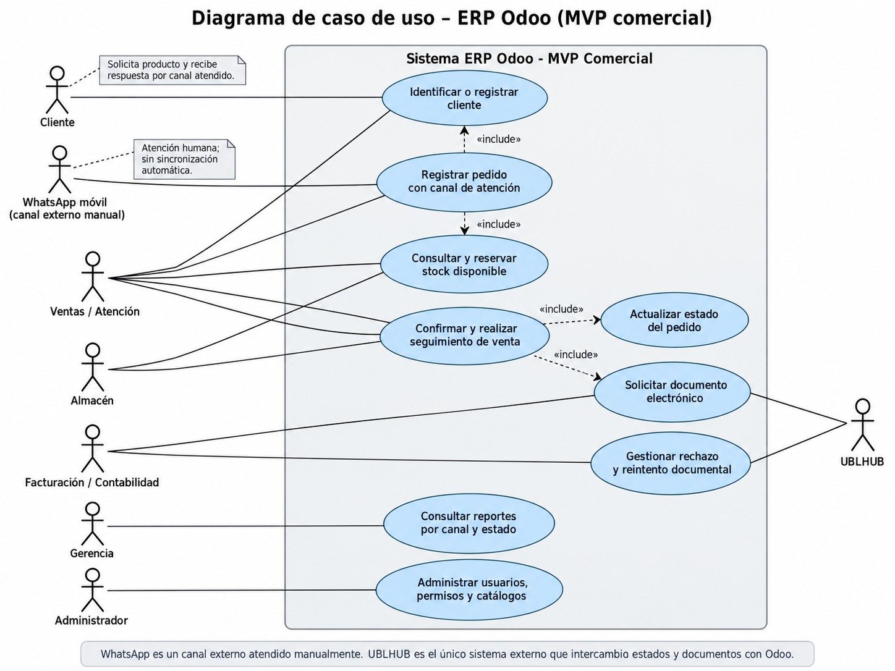

# Casos y criterios de aceptación

## Objetivo y alcance

Validar que los pedidos recibidos por WhatsApp móvil, atendido manualmente por un vendedor, se registren y sigan en Odoo junto con el cliente, el inventario, la venta y el documento electrónico cuando corresponda. La primera etapa no incluye conexión automática con WhatsApp ni envío automático de mensajes.

Los casos marcados como **No ejecutado** son criterios propuestos para el piloto; no representan pruebas realizadas ni funcionalidades ya disponibles en el prototipo visual.

## Diagrama de casos de uso

Para el alcance inicial basta un diagrama general: los canales comparten clientes, pedidos, inventario y seguimiento en Odoo. WhatsApp aparece como canal externo atendido manualmente, no como una integración del sistema. UBLHUB es el único sistema externo que intercambia estados y documentos con Odoo. Un segundo diagrama sería útil si se aprueba automatizar WhatsApp o si los flujos de emisión requieren más detalle; por ahora, separar el mismo alcance duplicaría información.

El cliente no inicia sesión en Odoo en este alcance. La comunicación por WhatsApp y el envío de respuestas al cliente son responsabilidad del vendedor; Odoo conserva el pedido y su estado. Las relaciones con UBLHUB aplican solo cuando el documento corresponda y la integración esté habilitada en el ambiente de prueba.

| Actor | Responsabilidad en el alcance | Casos relacionados |
| --- | --- | --- |
| Cliente | Solicita el producto y recibe confirmación o documento por el canal atendido. | WA-01, WA-08 |
| Ventas / atención | Busca o registra clientes, registra canal y pedido, consulta stock y actualiza seguimiento. | WA-01–WA-08, ERP-01 |
| Almacén | Verifica disponibilidad y prepara/controla la salida según permisos y reglas aprobadas. | WA-04–WA-06, ERP-01, SEG-01 |
| Facturación / contabilidad | Gestiona emisión, validación, rechazo y reintento de documentos. | UBL-01–UBL-06, SEG-01 |
| UBLHUB | Recibe solicitudes de emisión y devuelve identificadores, estados, mensajes y archivos disponibles. | UBL-01–UBL-06 |
| Gerencia | Consulta resultados por canal, tipo de cliente y estado. | REP-01 |
| Administrador | Configura usuarios, permisos, catálogos y parámetros necesarios para las pruebas. | SEG-01 y precondiciones |

## Precondiciones de ejecución

- Ambiente de pruebas de Odoo con usuarios y permisos definidos; ambiente sandbox y credenciales de prueba de UBLHUB para los casos de emisión.
- Catálogo, precios, impuestos, stock inicial y reglas de reserva/salida cargados y aprobados.
- Datos ficticios de clientes, productos, pedidos y referencias de atención. No usar conversaciones ni datos personales reales en evidencias.
- Reglas aprobadas para tipo de cliente, datos tributarios, pago, entrega/recojo, documentos aplicables, anulación y reintentos.
- Registrar por ejecución: fecha, responsable, resultado real, evidencia y, si corresponde, incidencia.

## Flujo prioritario: pedido recibido por WhatsApp

| ID | Escenario y pasos | Criterio de aceptación | Estado |
| --- | --- | --- | --- |
| WA-01 | Recibir una solicitud ficticia por WhatsApp y registrarla manualmente en Odoo. | Se crea un único pedido con canal `WhatsApp móvil`, vendedor responsable y una referencia mínima que permita ubicar la atención. No se requiere copiar la conversación completa ni existe sincronización automática. | No ejecutado |
| WA-02 | Buscar un cliente existente por documento/RUC antes de registrar el pedido; probar también una coincidencia ambigua por contacto. | La ficha existente puede seleccionarse y no se crea un duplicado por documento/RUC. Si el contacto produce varias coincidencias, el vendedor puede revisarlas antes de elegir; no se fusionan fichas automáticamente. | No ejecutado |
| WA-03 | Registrar un pedido de consumidor final nuevo usando los datos mínimos definidos para ese tipo de cliente. | Se crea una sola ficha vinculada al pedido. Odoo exige los campos aprobados y permite continuar sin solicitar datos que no sean necesarios para la operación o el documento elegido. | No ejecutado |
| WA-04 | Registrar productos y cantidades solicitados; consultar la disponibilidad antes de confirmar. | Odoo muestra la disponibilidad del inventario configurado y aplica la regla aprobada de reserva o salida. El pedido conserva productos, cantidades y cliente correctos. | No ejecutado |
| WA-05 | Solicitar una cantidad superior al stock disponible sin autorización de preventa y repetir con una excepción autorizada. | Sin autorización, no se confirma una cantidad que exceda el stock. Si se permite la excepción, queda registrada la autorización, el responsable y la condición aplicada; el disponible no se altera silenciosamente. | No ejecutado |
| WA-06 | Confirmar un pedido con stock suficiente y seguirlo hasta la venta. | Pedido, venta y movimiento de inventario quedan relacionados con el mismo cliente y canal. La operación produce un solo movimiento por la cantidad confirmada y conserva la referencia de atención. | No ejecutado |
| WA-07 | Intentar registrar por segunda vez el mismo pedido usando la misma referencia de atención. | Odoo permite localizar el pedido ya registrado o advierte la posible duplicidad; no se genera una segunda venta ni se vuelve a mover el stock por el mismo pedido. | No ejecutado |
| WA-08 | Actualizar el estado del pedido durante preparación y entrega/recojo, y comunicar el resultado al cliente desde la atención de WhatsApp. | El estado vigente y sus cambios quedan visibles en Odoo, vinculados al pedido y al usuario que los registró. El vendedor puede informar el resultado por WhatsApp; no se presupone envío automático desde Odoo. | No ejecutado |

## Casos compartidos y documentos

| ID | Escenario y pasos | Criterio de aceptación | Estado |
| --- | --- | --- | --- |
| ERP-01 | Registrar una venta presencial con el mismo producto de prueba. | El pedido queda identificado como `ERP/presencial`, no como WhatsApp, y sigue las mismas validaciones de cliente, stock y trazabilidad. | No ejecutado |
| UBL-01 | Emitir una boleta de prueba para una venta y cliente que cumplan las reglas aprobadas. | UBLHUB devuelve un identificador, estado y archivos disponibles; Odoo los conserva vinculados a la venta y al pedido correctos. | No ejecutado |
| UBL-02 | Emitir una factura de prueba con RUC y datos tributarios válidos; repetir con datos obligatorios inválidos. | Con datos válidos, el resultado queda vinculado a la venta. Con datos inválidos, se informa qué corregir y no se registra como emitida una factura rechazada por validación. | No ejecutado |
| UBL-03 | Emitir una guía de remisión solo para un caso de traslado que, según las reglas aprobadas, la requiera. | La guía conserva la relación con la venta y el traslado. Si el caso no requiere guía, Odoo no solicita su emisión. | No ejecutado |
| UBL-04 | Repetir una solicitud de emisión con la misma venta y tipo de documento, incluyendo una respuesta demorada. | La integración consulta o devuelve el resultado asociado a la misma clave idempotente; no crea una segunda emisión para la misma operación. | No ejecutado |
| UBL-05 | Simular el rechazo de un documento y corregir los datos para un nuevo intento autorizado. | Odoo conserva el rechazo original, el mensaje devuelto, la fecha y el responsable; muestra una acción correctiva y mantiene la relación con la venta. El nuevo intento no borra la auditoría anterior. | No ejecutado |
| UBL-06 | Simular indisponibilidad de UBLHUB después de confirmar la venta y reintentar al recuperar el servicio. | La venta y su movimiento de inventario permanecen registrados; el documento queda pendiente, el error es visible y el reintento no duplica ni la venta, ni el movimiento, ni el documento. | No ejecutado |
| REP-01 | Consultar ventas de prueba y filtrar por canal, tipo de cliente y estado. | Los filtros devuelven los registros correspondientes y permiten distinguir WhatsApp móvil de ERP/presencial. Los totales del reporte concuerdan con las ventas incluidas en la consulta. | No ejecutado |
| SEG-01 | Revisar permisos de vendedor, almacén y facturación; preparar capturas y evidencias de la ejecución. | Cada rol solo realiza las acciones autorizadas. Las evidencias usan datos sintéticos y no exponen teléfonos, documentos, conversaciones, credenciales ni otros datos personales reales. | No ejecutado |

## Registro de ejecución

Completar una fila por caso ejecutado. Mantener el estado **No ejecutado** hasta contar con evidencia del resultado.

| ID | Fecha | Responsable | Resultado (Aprobado/Fallido) | Evidencia o incidencia |
| --- | --- | --- | --- | --- |
|  |  |  |  |  |

## Pendientes antes del piloto

Confirmar los campos mínimos de cada tipo de cliente, el criterio de referencia única para una atención de WhatsApp, las reglas de reserva/salida y preventa, los estados de pago y entrega, y las condiciones tributarias para boleta, factura, guía, anulación y reintento. Ejecutar los casos de UBLHUB únicamente cuando estén disponibles su sandbox, contrato de API y reglas aprobadas.
